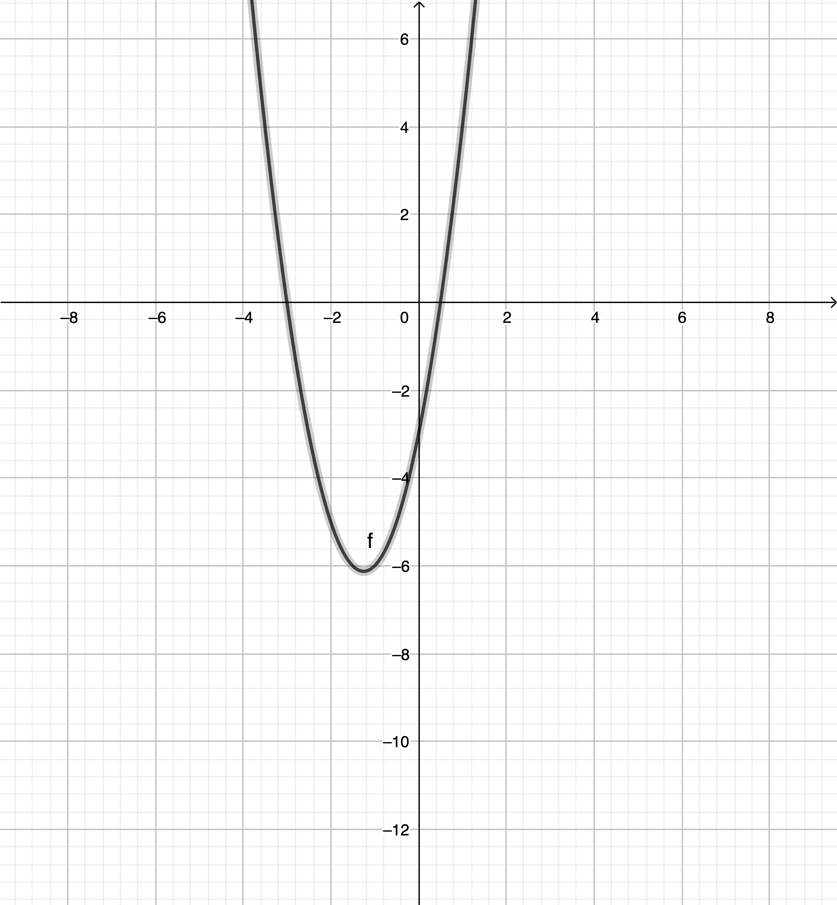
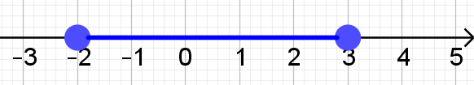
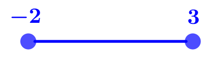
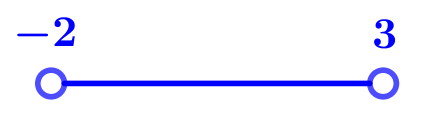
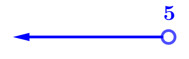
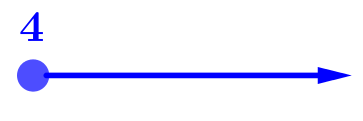
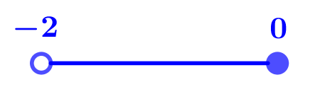
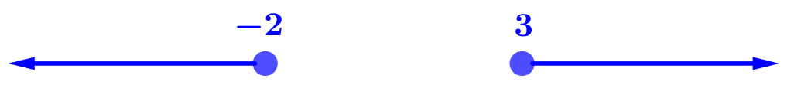
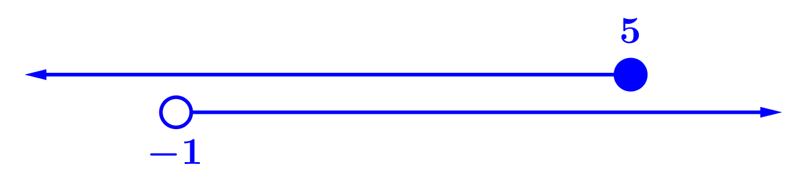
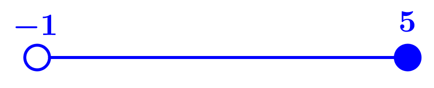

[View on edX](https://learning.edx.org/course/course-v1:ImperialX+alm001+3T2018/block-v1:ImperialX+alm001+3T2018+type@sequential+block@bb3496edf7e04656a290c786f9e3bb12/block-v1:ImperialX+alm001+3T2018+type@vertical+block@0b090fd7ab2342d89a63f96492bc7909)

> 
> **Learning Outcomes**
>
> * Solve **linear** and **quadratic inequalities** in a single variable and interpret these solutions graphically.
> * Express the solutions to linear and quadratic inequalities using **number lines** and **inequality notation**, and using the terms **‘and’** and **‘or’** and  **set notation**.
> * Represent linear and quadratic inequalities in two variables **graphically**, using standard A level conventions.

# What is an Inequality?
An **inequality** is a statement involving one of these four operators:

* $\lt$ less than
* $\gt$ greater than
* $\le$ less than or equal to
* $\ge$ greater than or equal to

An example of an **algebraic inequality** might be $4x+3\le11$. 

## Exercise 1
Let's solve a simpler inequality: $2(x+1)\lt5(x-2)$. Remember that you want to work out what values of $x$ this statement is true for.

|Calculation |Next Step |
|:---|:---|
|$2(x+1)\lt5(x-2)$ |Expand the brackets |
|$2x+2\lt5x-10$ |Subtract $2x$ from each side |
|$2\lt3x-10$ |Add $10$ to each side |
|$12\lt3x$ |Divide by $3$ |
|$4\lt{x}$ |Put $x$ on the left hand side |
|$x\gt4$ | |
: Ex 1: Steps to solve $2x+1\lt5x-2$

## Exercise 2
Solve $-4x\le-20$.

|Calculation |Next Step |
|:---|:---|
|$-4x\le-20$ |Add $4x$ to each side to make a positive value of $x$ |
|$0\le-20+4x$ |Add $20$ to each side |
|$20\le{4x}$ |Divide by 4 |
|$5\le{x}$ |Put $x$ on the left hand side |
|$x\ge5$ | |
: Ex 2: Steps to solve $-4x\le-20$

## Testing Inequalities
The solution to an inequality is a set of values e.g. the solution to $2x\gt10$ is $x\gt5$ would mean the set of all values of $x$ that are greater than $5$.

You can test inequalities by looking at some values in the solution set and testing them in the original inequality.  In the example given above, $x=6$ is in the solution set and so when it is substituted into the original inequality $2x\gt10$ you get $12\gt10$ which is true. Substituting something that is not in the solution set e.g. $x=3$ would give a false result (in this case $6\gt10$).

With Example 2 above, $-4x\le-20$, one might think that the easiest way to solve this would be to divide by $-4$ throughout, like you would with an equation, and that looks like it would give the solution $x\le5$. But, if you think about the value $x=4$, this would yield $-16\le-20$ which is false. By rearranging the equation as we did in the calculations above, we get the correct answer of $x\ge5$.

> 
> **Quick Rule**
>
> When you **multiply or divide by something negative** you should **swap the direction of the inequality**.

# Quadratic Inequalities
We have looked at linear inequalities. Quadratic inequalities are a little tougher to handle. Here, it is helpful to have a diagram (i.e. to sketch the curve).

## Exercise 3
Solve $2x^2+5x-3\le0$.

Our tactic here will be to sketch the curve $y=2x^2+5x-3$. First, let's see if this equation can be solved by factorising.

|Calculation |Next Step |
|:---|:---|
|$y=2x^2+5x-3$ |Multiply the coefficient of $x^2$ ($2$) by the constant term $c$ ($-3$).|
|$2\times-3=-6$ |Find two numbers which have a product of $-6$ and a sum of $5$. $6$ and $-1$ satisfy this rule. Rewrite the $5x$ as $6x-x$. |
|$y=2x^2+6x-x-3$ |Factorise the first two terms and the last two terms separately. The bracket created should be the same. |
|$y=2x(x+3)-(x+3)$ |Find the final brackets. The first bracket is the common factor. The second bracket is the factorised terms outside each bracket. |
|$y=(x+3)(2x-1)$ |Solve for $x$ when $y=0$. |
|$y=0$ when $x=-3$ or $x=0.5$ | |
: Ex 3: Solve the equation by factorising

Now let's sketch $y=(x+3)(2x-1)$.

What we want to know is what are the values of $x$ for which $y\le0$? We can say that this is true for the points on the graph that lie on the x-axis ($y=0$ when $x=-3$ and $x=0.5$). But we can also say that $y\lt0$ for all of the $x$ values that lie in between those two points.

Therefore, this inequality is satisfied for $-3\le{x}\le0.5$.

# Expressing Inequalities

|Method|Example|Comments|
|:---|:---|:---|
|Set|$\{x:-3\le{x}\le0.5\}$|The set of $x$ such that $-3$ is less than or equal to $x$ and $x$ is less than or equal to $0.5$.|
|Interval|$[-3,0.5]$|Endpoints included|
|Interval|$(-3,0.5)$|Endpoints excluded|
: Different methods of expressing inequalities

The solutions to inequalities can be written in several ways. For A level you need to know and be fluent with two of these: using a **number line** and using **set notation**. It is also useful to know how to use **interval notation** as this gives a precise way to express the solutions and is generally quicker to write.

## Using a Number Line
The set of values $-2\le{x}\le3$ representing the solution to the inequality $(x+2)(x-3)\le0$ includes all of the $x$ values from negative $2$ to positive $3$ inclusive. This can be represented on a number line like this: 

In practice, drawing an actual number line is more effort than is really needed to get the message across so  the scale is not used and the values are written by the circles like this:

This number line shows all of the values **between** $-2$ and $3$. It also shows that it **includes** both the value $x=-2$  and the value $x=3$ by having both small circles **shaded in**.

### Representing Strict Inequalities
A strict inequality is an inequality where the inequality symbol is either $\gt$ (greater than) or $\lt$ (less than). That is, a strict inequality is an inequality which does not include an equals (so $\ge$ is not a strict inequality). The solution to the inequality $(x+2)(x-3)\lt0$ is the set of values $-2\lt{x}\lt3$. This would be represented using a number line diagram like this:

The values $-2$ and $3$ are **not included** in the solution set and so are represented by **open circles**.

### Some Examples
The following examples illustrate some inequalities, their solution sets and how they are represented using the number line notation. Make sure that you can understand how the notation has been used for each one.

|Example |Solution Set |Number Line|
|:---|:---|:---|
|$2x-3\lt7$|$x\lt5$||
|$3x+2\ge14$|$x\ge4$||
|$-3\lt2x+1\le1$|$-2\lt{x}\le0$||
: Examples of number lines

In these examples an arrow has been used to show where a set of values continues to either negative infinity (in the first example) or infinity (in the second example).

### AND and OR
A solution set may be made up of a combination of sets of values for example the solution set for the inequality $(x-3)(x+2)\ge0$ includes all values less than or equal to $-2$ i.e. $x\le-2$ and all the values greater than or equal to $3$ i.e. $x\ge3$. The word "and" in that sentence is a little unhelpful in this context.

The correct way to think about it is that for the multiplication $(x-3)\times(x+2)$ to give a result of $0$ or greater, the value of $x$ needs to come from either the set of values for which $x\le-2$ **OR** the set of values for which $x\ge3$.

We would represent this on a number line as:

A very rough way of writing this using inequalities is $x\le-2$ **OR** $x\ge3$.

The word **AND** when applied to two sets of values means those values for which **both** descriptions are true. For example, $x\le5$ AND $x\gt-1$ means the set of values for which both are true. Comparing the number line diagrams gives:

You can see from the overlap of the two sets of values that the region for which they are **both** true is $-1\lt{x}\le5$.

So $x\le-5$ AND $x\gt-1$ is equivalent to $-1\lt{x}\le5$ and would be shown on a number line as:

## Using Set Notation
The set of values $-2\le{x}\le3$ representing the solution to the inequality $(x-3)(x+2)\le0$ was represented on the number line by:

A fairly compact mathematical way of writing this is to use set notation. For this set of values we would write $\{x:-2\le{x}\le3\}$.

The curly brackets $\{\}$ indicate that you are using set notation. The $x:$ at the start defines the variable that you are using for the set of values that you are defining. The actual values that make up the set are then defined using inequalities.

It is worth saying that the set of values above could be written $\{y:-2\le{y}\le3\}$. All that is happening here is that you are saying that you've decided to call the values $y$ rather than $x$. The name is not particularly important provided you are consistent in using it throughout. 

### Some Examples using Set Notation
You have seen these examples before. This time the final way to write the solution uses set notation. Make sure that you can understand how the notation has been used for each one.

|Example |Solution Set |Number Line|Set Notation|
|:---|:---|:---|:---|
|$2x-3\lt7$|$x\lt5$||$\{x:x\lt5\}$|
|$3x+2\ge14$|$x\ge4$||$\{x:x\ge4\}$|
|$-3\lt2x+1\le1$|$-2\lt{x}\le0$||$\{x:-2\lt{x}\le0\}$|
: Examples of set notation

### AND and OR with Set Notation
The solution to the inequality $(x-3)(x+2)\ge0$ was written as $x\le-2$ **OR** $x\ge3$. This can be written in a better way in set notation using the $\cup$ symbol (union).

The solution to $(x-3)(x+2)\ge0$ using set notation is $\{x:x\le-2\}\cup\{x:x\ge3\}$. There's not a lot of difference in the number of characters that have to be written but it looks far more mathematical!

The symbol $\cap$ (intersection) is used for **AND**. The solution set $x\le5$ **AND** $x\gt-1$ would be written $\{x:x\gt-1\}\cap\{x:x\le5\}$. It is worth noting that it is better to write this set of values as $\{x:-1\lt{x}\le5\}$ which is equivalent and much more compact.

## Using Interval Notation
The set of values $-2\le{x}\le3$ representing the solution to the inequality $(x-3)(x+2)\le0$ was represented on the number line by:

A fairly compact mathematical way of writing this is to use interval notation. For this set of values we would write $[-2,3]$. Square brackets are used for included values and normal brackets for excluded values.

Interval notation is not particularly used at A level but it is worth knowing particularly if you intend to study mathematics or a related subject at university.

### Some Examples Using Interval Notation
This time, the examples are written with the addition of interval notation in the final column. Make sure that you can understand how the notation has been used for each one.

|Example |Solution Set |Number Line|Set Notation|Interval Notation|
|:---|:---|:---|:---|:---|
|$2x-3\lt7$|$x\lt5$||$\{x:x\lt5\}$|$(-\infty,5)$|
|$3x+2\ge14$|$x\ge4$||$\{x:x\ge4\}$|$[4,\infty)$|
|$-3\lt2x+1\le1$|$-2\lt{x}\le0$||$\{x:-2\lt{x}\le0\}$|$(-2,0]$|
: Examples of interval notation

# More on Quadratic Inequalities
## Exercise 4
Going back to our earlier example $y=(2x-1)(x+3)$, what if we wanted to know all the values of $x$ for which $y\ge0$?

We can see that this is true at the points where the x-value crosses the y-axis ($-3$ and $0.5$) but it's also true everywhere to the left of $x=-3$ and to the right of $x=0.5$.

Expressing this in set notation gives: $\{x:x\le-3\}\cup\{x:x\ge0.5\}$.

Expressing this in interval notation gives: $(-\infty,-3]\cup[0.5,\infty)$ (note that it doesn't make sense to have infinity included in the range, therefore we use round brackets at that end).

## Exercise 5
Now let's think about a challenging problem. The equation $x^2+y^2-2x-14y+32=0$ represents a **circle**. The equation $y=mx$ represents a straight line through the origin.

 <iframe src="https://www.geogebra.org/classic/ksp7hdmg?embed" width="800" height="600" allowfullscreen style="border: 1px solid #e4e4e4;border-radius: 4px;" frameborder="0"></iframe>
 
The angle of the straight line depends on the value we have for $m$. For some values of $m$, the straight line crosses the circle or just touches it. For other values of $m$ the straight line misses the circle entirely.

**What are the approximate values of $m$ for which the straight line crosses or touches the circle?**

Using the applet, it seems that the line touches the circle at a value of $-1.82$ at one extreme and at a value of $1$ at the other extreme (and at all points in between). The approximate answer therefore is $\{m:-1.82\le{m}\le1\}$.

**How can you use what you know to get some exact values?**

* The equation of the circle is: $x^2+y^2-2x-14y+32=0$.
* The equation of the line is: $y=mx$.

Solving the two equations simultaneously will give us the points where the line crosses the circle.  

|Calculation |Next Step |
|:---|:---|
|$y=mx$ $x^2+y^2-2x-14y+32=0$|Substitute $y=mx$ into $x^2+y^2-2x-14y+32=0$.|
|$x^2+(mx)^2-2x-14(mx)+32=0$|Multiply out the $mx$ terms.|
|$x^2+m^2x^2-2x-14mx+32=0$|Gather $x^2$ and $x$ terms.|