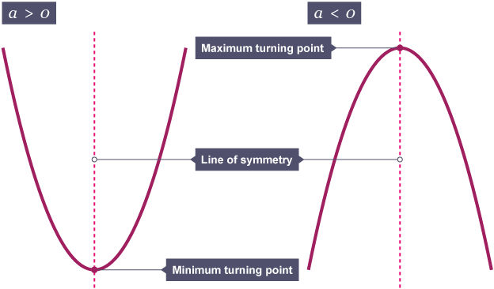
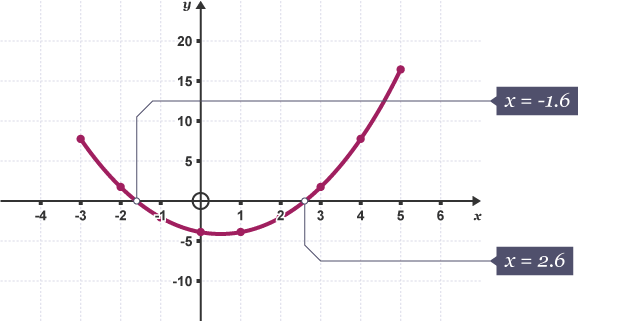
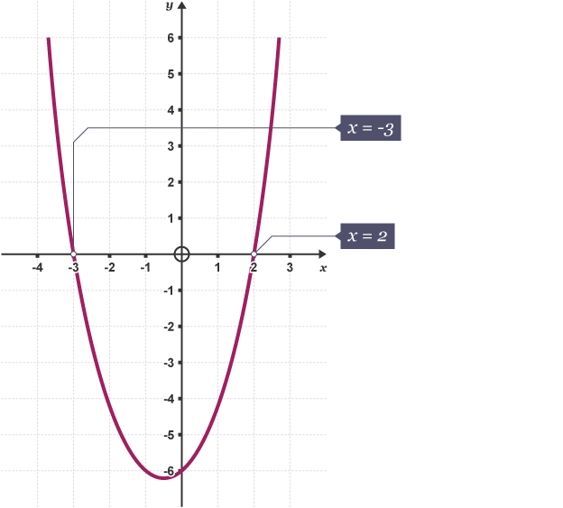
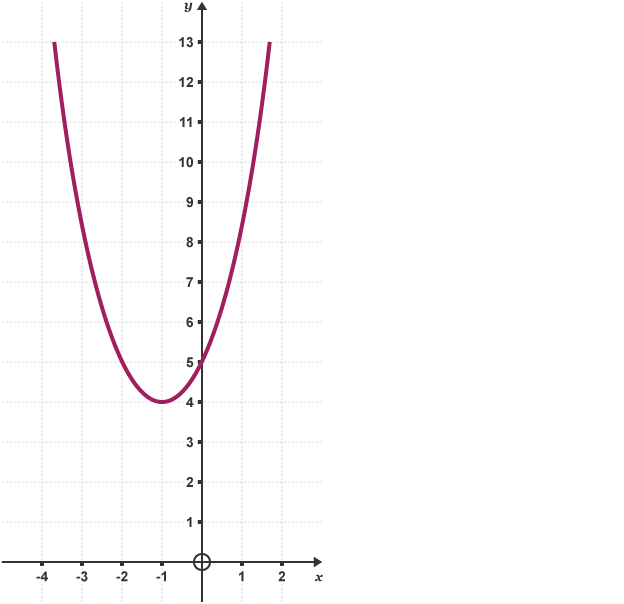
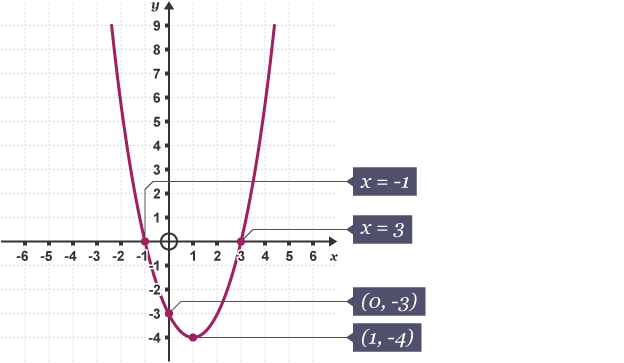

# Solving Quadratic Equations
Quadratic equations can be solved by:

* Factorising
* Using formulae
* Completing the square

All quadratic equations can be written as $ax^2+bx+c=0$ (where $a$ cannot be equal to zero but $b$ and $c$ can).

The table below shows some examples of quadratic equations in their different forms.

|Example        |Comments                                    |
|:--------------|:-------------------------------------------|
|$2x^2-2x-3=0$  |                                            |
|$2x(x+3)=0$    |The bracket can be expanded to $2x^2+6x=0$  |
|$(2x+1)(x-5)=0$|The bracket can be expanded to $2x^2-9x-5=0$|
|$x^2+2=4$      |This can be rearranged as $x^2-2=0$         |
|$3x^2=48$      |This can be rearranged as $3x^2-48=0$       |
: Examples of quadratic equations in different forms

The last example $3x^2=48$ is a quadratic equation that can be solved simply:

$$
\begin{aligned}
3x^2=48\\
x^2=16\\
x=\pm4
\end{aligned}
$$

Remember, the answer to a quadratic equation can be either the **positive** or the **negative** root.

# How to Factorise
**Factorising** is the reverse process of expanding the brackets, so factorising $x^2+5x+6$ gives $(x+2)(x+3)$. A factorised answer will always contain **a set of brackets**.

To factorise an expression fully, take out the **highest common factor (HCF)** of all the terms. For example, $2x$ is the HCF of $4x^2$ and $6x$ as 2 is the biggest number that will divide into $x^2$ and $x$.

## Example 1
Factorise $6x+9$.

To factorise this expression, look for the HCF of $6x$ and $9$ which is $3$. To factorise, write down the HCF and then begin a set of brackets. Find the missing numbers in the brackets by dividing each term by the HCF.

The HCF of $6x+9$ is $3$. Put this outside the bracket:

$3(?+?)$

Find the missing terms in the bracket by dividing each term by the HCF:

$6x\div3=2x$ and $9\div3=3$.

This gives $3(2x +3)$.

To check this answer is right, expand the bracket and check that the answer matches the original equation.

## Question 1
Factorise $12ab-8ac+4a^2b$.

The HCF is $4a$.

$4a(3b-2c+ab)$

# Factorising Quadratics
In a **quadratic expression**, the highest power of $x$ is $x^2$. A quadratic expression can sometimes be factorised into two brackets in the form of $(x+a)(x+b)$ where $a$ and $b$ can be any term, positive, negative or zero. $a$ and $b$ can be found by using a **product** and **sum** method.

Expanding the brackets $(x+2)(x+3)$ gives $x^2+5x+6$. Factorising is the reverse process of expanding brackets, so factorising $x^2+5x+6$ gives $(x+2)(x+3)$.

## Example 2
Factorise $x^2+7x+10$.

To factorise this expression, find two numbers that have a product of +10 and a sum of +7.

There are a couple of ways of making +10 by multiplying two numbers. These are $1\times10$ and $2\times5$. Only the combination of 2 and 5 will give a sum of +7, so the two numbers are 2 and 5.

$x^2+7x+10=(x+2)(x+5)$

To check this answer is correct, expand out the brackets.

$$
\begin{aligned}
(x+2)(x+5)\\
=x\times{x}+x\times5+2\times{x}+2\times5\\
=x^2+5x+2x+10\\
=x^2+7x+10
\end{aligned}
$$

This is the original expression, so $(x+2)(x+5)$ is the correct factorisation.

## Example 3
Factorise $y^2-12y+11$.

As there is a negative sign in the quadratic, it is helpful to remember the sign rules, ie two same signs make a positive and two different signs make a negative.

To factorise this quadratic, find two numbers that have a product of +11 and a sum of -12.

11 is a prime number, so the only way of multiplying two numbers to make 11 is $11\times1$.

$11+1$ will add up to +12 not -12, so the numbers must be -11 and -1 as $-11\times-1=11$.

$=(y-11)(y-1)$

To check this answer is correct, expand out the brackets:

$$
\begin{aligned}
(y-11)(y-1)\\
=(y\times{y})+(y\times-1)+(-11\times{y})+(-11\times-1)\\
=y^2-y-11y+11\\
=y^2-12y+11
\end{aligned}
$$

This is the original expression, so $(y-11)(y-1)$ is the correct factorisation.

## The Difference of Two Squares
The **difference** of two numbers is found by subtracting. The difference of two squares means one squared term subtract another squared term. For example, $x^2-9$ would be the difference of two squares as $x^2$ is a squared term ($x$ has been multiplied by itself) and 9 is a square number.

The difference of two squares can be factorised into brackets using the method above for factorising quadratics.

## Example 4
Factorise $x^2-4$.

Quadratics can be factorised in the form $(x+a)(x-a)$.

$x^2-4$ can be written as $x^2+0x-4$.

To factorise this quadratic, find two numbers that have a product of -4 and a sum of 0.

The **factor pairs** that make -4 are either $-1\times4$, $1\times-4$ or $-2\times2$. The factor pair that has a product of -4 and a sum of 0 is $-2\times2$.

Therefore, the two numbers to give to the brackets are -2 and 2.

This gives $(x-2)(x+2)$.

> If the quadratic is in the form $x^2-a^2$ then its factorised form is $(x-a)(x+a)$.

## Factorising Quadratics when the Coefficient of $x^2$ ≠ 1
Quadratic expressions can be written in the form $ax^2+bx+c$, where $a$, $b$ and $c$ are numbers.

$a$ is called the coefficient of $x^2$ and $b$ is the coefficient of $x$. $c$ is a constant term – it is a number that is not multiplied by the variable $x$.

For example, for the quadratic expression $6x^2+13x+6$, $a$ = 6, $b$ = 13 and $c$ = 6.

To factorise this quadratic, first multiply the **coefficient** of $x^2$ by the constant term ($c$).

$$
6x^2+13x+6\\
6\times6=36
$$

$6\times6$ is 36. Find the two numbers which have a product of 36 and a sum of 13. These are 4 and 9. Rewrite $13x$ as $4x+9x$ as these are the two numbers found by the product and sum rule.

$$
6x^2+4x+9x+6
$$

Factorise the first two terms and the last two terms separately. The bracket created should always be the same.

$$
\begin{aligned}
6x^2+4x+9x+6\\
=2x\mathbf{(3x+2)}+3\mathbf{(3x+2)}
\end{aligned}
$$

The two brackets can now be found. The first bracket is the common factor of $(3x+2)$. The second bracket is the factorised terms outside each bracket $(2x+3)$

$$
\begin{aligned}
6x^2+4x+9x+6\\
=2x(3x+2)+3(3x+2)\\
=(3x+2)(2x+3)
\end{aligned}
$$

## Example 5
Factorise $6x^2-7x-3$.

First, multiply the coefficient of $x^2$ by the constant term ($c$).

$6\times-3 = -18$

Find two numbers which have a product of -18 and a sum of -7. These are 2 and -9. Rewrite the centre term as these two numbers.

$6x^2+2x-9x-3$

Factorise each pair of terms. Check that the bracket created is the same.

$$
\begin{aligned}
6x^2+2x-9x-3\\
=2x(3x+1)-3(3x+1)
\end{aligned}
$$

Find the final brackets.

$$
\begin{aligned}
6x^2+2x-9x-3\\
=2x(3x+1)-3(3x+1)\\
=(3x+1)(2x-3)
\end{aligned}
$$

# Solving by Factorising
If the **product** of two numbers is zero then one or both of the numbers must also equal zero. Therefore:

$$
\text{If } ab=0\\
\text{Then } a=0 \text{ and/or } b=0
$$

$$
\text{If } (x+1)(x+2)=0\\
\text{Then } x+1=0 \text{ and/or } x+2=0
$$

## Example 6
Solve $x(x+3)=0$.

The product of $x$ and $x+3$ is 0, so either $x=0$ or $x+3=0$, or both.

$$
\begin{aligned}
x+3=0\\
x=-3\\
\\
x=0 \text{ or } x=-3
\end{aligned}
$$

## Question 2
Solve $(x+1)(x-5)=0$.

Either $x+1=0$ or $x-5=0$.<br>
$\{x:x=-1\}\cup{}\{x:x=5\}$

## Question 3
Solve $x^2+7x+12=0$.

First, find two numbers that have a product of 12 and a sum of 7. These numbers are 3 and 4. Rewrite the equation using these numbers.

$$
\begin{aligned}
x^2+3x+4x+12\\
=(x+3)(x+4)
\end{aligned}
$$

Therefore, we now know that the quadratic equation is $(x+3)(x+4)=0$.

The product of $x+3$ and $x+4$ is 0. So either $x+3=0$ or $x+4=0$ or both.<br>
$\{x:x=-3\}\cup{}\{x:x=-4\}$

# Solving by Quadratic Formula
Using the **quadratic formula** is another method of solving quadratic equations that will not factorise.

> The quadratic formula for a quadratic equation in the form of $ax^2+bx+c=0$ is $x=\frac{-b\pm\sqrt{b^2-4ac}}{2a}$.

## Example 7
Solve $x^2+6x-12=0$ using the quadratic formula.

First, identify the value of $a$, $b$ and $c$. In this example, $a=1$, $b=6$ and $c=-12$. Substitute these values into the quadratic formula.

$$
\begin{aligned}
x=\frac{-b\pm\sqrt{b^2-4ac}}{2a}\\
x=\frac{-6\pm\sqrt{6^2-4\times1\times-12}}{2\times1}\\
x=\frac{-6\pm\sqrt{36+48}}{2}\\
x=\frac{-6\pm\sqrt{84}}{2}\\
x=\frac{-6\pm2\sqrt{21}}{2}\\
x=-3\pm\sqrt{21}
\end{aligned}
$$

The decimal answers to this equation would be:
```{r e7}
(e7_answer <- c(-3+sqrt(21),
                -3-sqrt(21)))
```

## Question 4
Solve $2x^2-10x+3=0$ using the quadratic formula.

First, identify the value of $a$, $b$ and $c$. In this question, $a=2$, $b=-10$ and $c=3$. Substitute these values into the quadratic formula.

$$
\begin{aligned}
x=\frac{-b\pm\sqrt{b^2-4ac}}{2a}\\
x=\frac{10\pm\sqrt{-10^2-4\times2\times3}}{2\times2}\\
x=\frac{10\pm\sqrt{100-24}}{4}\\
x=\frac{10\pm\sqrt{76}}{4}\\
x=\frac{10\pm2\sqrt{19}}{4}\\
x=\frac{5}{2}\pm\frac{1}{2}\sqrt{19}
\end{aligned}
$$

The decimal answers to this equation would be:
```{r q4}
(q4_answer <- c((5/2)+(1/2)*sqrt(19),
                (5/2)-(1/2)*sqrt(19)))
```

# Solving by Completing the Square
Some quadratics cannot be factorised. An alternative method to solve a quadratic equation is to **complete the square**.

To solve an equation of the form $x^2+bx+c=0$ consider the expression $(x+\frac{b}{2})^2+c$.

$(x+\frac{b}{2})^2+c$ expands to $x^2+bx+(\frac{b}{2})^2+c$, which is the same as the left-hand side of the original equation but with an extra term $(\frac{b}{2})^2$.

To get back to the correct original expression, this extra term has to be subtracted.

So the equation $x^2+bx+c=0$ becomes $(x+\frac{b}{2})^2-(\frac{b}{2})^2+c=0$.

This can be rearranged to give $(x+\frac{b}{2})^2=(\frac{b}{2})^2-c$ which can then be solved by taking the square root of both sides.

## Example 8
Solve $x^2+6x-10=0$ by completing the square.

> **Start by following the formula:**<br>$x^2+bx+c = (x+\frac{b}{2})^2-(\frac{b}{2})^2+c$

For this example, this gives: $(x+\frac{6}{2})^2-(\frac{6}{2})^2-10=0$<br>
This will simplify to: $(x+3)^2-(3)^2-10=0$<br>
This simplifies further to: $(x+3)^2-9-10=0$, which simplifies further to $(x+3)^2-19=0$.

Rearrange this quadratic to get $(x+3)^2$ alone on the left side, by adding 19 to each side.

$(x+3)^2=19$

Find the square root of both sides to isolate $(x+3)$.

$x+3=\pm\sqrt{19}$

Subtract 3 from each side to isolate $x$.

$x=-3\pm\sqrt{19}$

This is the solution to the question in **surd** form, which gives the exact values of the solutions. If you are asked for exact solutions, leave your answer in surd form.

To find approximate solutions in decimal form, continue on with a calculator, adding and subtracting the square root to find the two solutions.

The decimal answers to this equation would be:
```{r e8}
(e8_answer <- c(-3+sqrt(19),
                -3-sqrt(19)))
```

## Question 5
Solve $x^2-4x-3=0$ by completing the square.

In this question $a=1$, $b=-4$ and $c=-3$.

Let's first arrange this equation in the form $x^2+bx+c = (x+\frac{b}{2})^2-(\frac{b}{2})^2+c$.

$$
\begin{aligned}
x^2-4x-3=0\\
\therefore(x+\frac{-4}{2})^2-(\frac{-4}{2})^2-3=0\\
\therefore(x-2)^2-(-2)^2-3=0\\
\therefore(x-2)^2-4-3=0\\
\therefore(x-2)^2-7=0\\
\therefore(x-2)^2=7\\
\therefore{x}-2=\pm\sqrt{7}\\
\therefore{x}=2\pm\sqrt{7}
\end{aligned}
$$

The decimal answers to this equation are:
```{r q5}
(q5_answer <- c(2+sqrt(7),
                2-sqrt(7)))
```

# Graphs of Quadratic Functions
All quadratic functions have the same type of curved graphs with a line of symmetry.

The graph of the quadratic function $y=ax^2+bx+c$ has a minimum turning point when and $a>0$ maximum turning point when $a<0$ . The turning point lies on the line of symmetry.

# Graph of $y = ax^2 + bx + c$


# Finding Points of Intersection
## Roots of a quadratic equation $ax^2 + bx + c = 0$
If the graph of the quadratic function $y=ax^2+bx+c$ crosses the x-axis, the values of $x$ at the crossing points are the **roots** or **solutions** of the equation $ax^2+bx+c=0$. If the equation $ax^2+bx+c=0$ has just one solution (a repeated root) then the graph just touches the x-axis without crossing it. If the equation $ax^2+bx+c=0$ has no solutions then the graph does not cross or touch the x-axis.

## Finding roots graphically
When the graph of $y=ax^2+bx+c$ is drawn, the solutions to the equation are the values of the x-coordinates of the points where the graph crosses the x-axis.

## Example 9
Draw the graph of $y=x^2-x-4$ and use it to find the roots of the equation to 1 decimal place.

Draw and complete a table of values to find coordinates of points on the graph.

| x | -3 | -2 | -1 |  0 |  1 |  2 | 3 | 4 |  5 |
|:-:|:--:|:--:|:--:|:--:|:--:|:--:|:-:|:-:|:--:|
| y |  8 |  2 | -2 | -4 | -4 | -2 | 2 | 8 | 16 |

Plot these points and join them with a smooth curve.



The roots of the equation $y=x^2-x-4$ are the x-coordinates where the graph crosses the x-axis, which can be read from the graph: $x=-1.6$ and $x=2.6$ (1 dp).

## Finding the Roots by Factorising
If a quadratic equation can be factorised, the factors can be used to find the roots of the equation.

## Example 10
$x^2+x-6=0$

The equation factorises to give $(x+3)(x-2)=0$ so the solutions to the equation $x^2+x-6=0$ are $x=-3$ and $x=2$.

The graph of $y=x^2+x-6$ crosses the x-axis at $x=-3$ and $x=2$.



## Example 11
$x^2-6x+9=0$

Using the **product and sum method** we know that the two numbers that sum to 6 and multiply to 9 are 3 and 3. Therefore, this equation can be factorised to $(x-3)(x-3)=0$. So there is just one solution to the equation, $x=3$.

The graph of $y=x^2-6x+9$ touches the x-axis at $x=3$.

## Example 12
$x^2+2x+5=0$

There are no integers that sum to 2 and multiply to 5, therefore this equation cannot be factorised. Instead we need to use the quadratic formula. In this case, $a=1$, $b=2$ and $c=5$ which gives:

$$
\begin{aligned}
x=\frac{-b\pm\sqrt{b^2-4ac}}{2a}\\
x=\frac{-2\pm\sqrt{2^2-4\times{1}\times{5}}}{2\times{1}}\\
x=\frac{-2\pm\sqrt{-16}}{2}
\end{aligned}
$$

It is not possible to find the square root of a negative number, so the equation has no solutions.

The graph of $y=x^2+2x+5$ does not cross or touch the x-axis so the equation $x^2+2x+5=0$ has no roots.



## Finding the y-intercept
The graph of the quadratic equation $y=ax^2+bx+c$ crosses the y-axis at the point $(0,c)$. The x-coordinate of any point on the y-axis has the value of 0 and substituting $x=0$ into the equation $y=ax^2+bx+c$ gives $y=c$.

## Question 6
Find the y-intercept of the following quadratic functions:

a.  $y=x^2+3x-2$<br>The y-intercept is $(0,-2)$.<br><br>
b.  $y=x^2+17$<br>The y-intercept is $(0,17)$.<br><br>
c.  $y=x^2+5x$<br>The y-intercept is $(0,0)$.

# Finding the Turning Point and the Line of Symmetry
The coordinates of the turning point and the equation of the line of symmetry can be found by writing the quadratic expression in completed square form.

## Example 13
Find the equation of the line of symmetry and the coordinates of the turning point of the graph of $y=x^2-6x+4$.

Writing $y=x^2-6x+4$ in completed square form gives $y=(x-3)^2-5$.

Squaring positive or negative numbers always gives a positive value. The lowest value given by a squared term is 0, which means that the minimum value of the term $(x-3)^2-5$ is given when $x=3$. This also gives the equation of the line of symmetry for the quadratic graph.

The value of $y$ when $x=3$ is -5. This value is always the same as the constant term in the completed square form of the equation.

So the graph of $y=x^2-6x+4$ has a line of symmetry with equation $x=3$ and a turning point at (3, -5)

## Question 7
Sketch the graph of $y=x^2-2x-3$, labelling the points of intersection and the turning point.

The **coefficient** of $x^2$ is positive, so the graph will be a positive U-shaped curve with a minimum turning point.

Factorising $y=x^2-2x-3$ gives $y=(x+1)(x-3)$ and so the graph will cross the x-axis at $x=-1$ and $x=3$.

The constant term in the equation $y=x^2-2x-3$ is -3, so the graph will cross the y-axis at (0, -3).

$$
\begin{aligned}
y=x^2-2x-3\\
y=(x+\frac{-2}{2})^2-(\frac{-2}{2})^2-3\\
y=(x-1)^2-(-1)^2-3\\
y=(x-1)^2-1-3\\
y=(x-1)^2-4
\end{aligned}
$$

Writing $y=x^2-2x-3$ in completed square form gives $y=(x-1)^2-4$, so the coordinates of the turning point are (1, -4).

So the graph of $y=x^2-2x-3$ has a line of symmetry with equation $x=1$ and a turning point at (1, -4).

